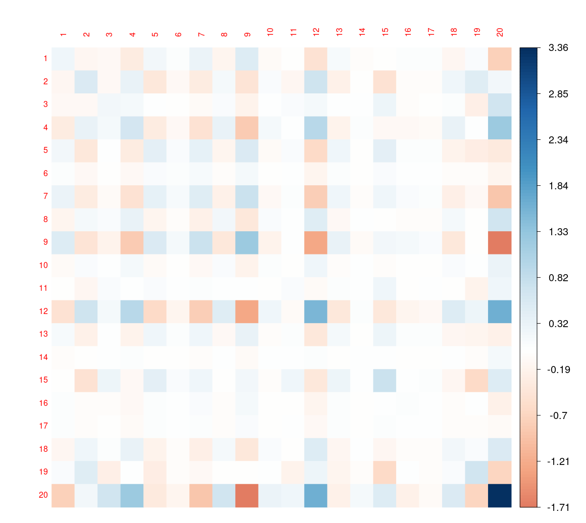

# ABC Model tutorial
## Overview


The Attributes-informed Brain Connectivity Model (ABC) model is specifically designed to model functional or structural connectivity matricies in combination with region level attribute information inorder to obtain a group level esitmate of connectivity informed by given attributes.


## Installation

This toolkit is implemented in R. Follow these steps for setup:


1. Clone or download the repository to your local machine.
2. Open R and navigate to the directory containing the toolkit and necessary helper functions.
3. Run the ABC model.


## Required Data


The toolkit is designed to analyze data consisting of brain connectivity and region level attribute information. Specifically, it requires two key files:

* `X`: a list of $V \times V$ brain connectivity data.
* `Y`: a list of $V \times P$ attribute data.

Additionally, simulated example data is available in the directory `data/X.rdata` and `data/Y.rdata` for demonstration purposes.


## Key parameters

* `W` a matrix of $N \times Q$ covariates for the connectivity data.
* `H` a matrix of $N \times Q1$ covariates for the attribute data.
* `K` number determining the latent dimension of multiplicative effects
* `nscan` number of iterations of the Markov chain (beyond burn-in)
* `burn` burn-in for the Markov chain

Note that sufficient burn-in is need to reach optimal covariance parameter estimates. See details in the method paper. 

## Usage


The main functionality of the ABC Toolkit is encapsulated in the `abc.r` script, which performs MCMC estimation. Example data are in the `examplefiles` folder. The `abc.r` can do the following connectivity data analysis:

### Run ABC model

``` {r}
library(abc.r)

setwd("./examplefiles") #directory of example data 

load(file='X.rdata')
load(file='Y.rdata')


model1=abc(X, Y,W=NULL, H=NULL, K = 2,
                   seed = 1, nscan = 10, burn = 1, odens = 1,
                   prior=list())

```


### Obtain unbiased estimates of covariance parameters.

From the saved model results, we can obtain estimated mean of $V \times V$ brain latent connectivity as `model1$UVPM`, posterior samples of the covariance parameters can be obtained via `model1$COV`, etc. See details in the pacakge documentation. 

ABC Simulation Example
================

## Introduction

This is a simulation study using the ABC package to analyze brain
connectivity data and attribute information. The simulation includes data
generation, model fitting, and result visualization. The goal is to
demonstrate how latent space models can be used to analyze the
relationship between brain connectivity patterns and region level attribute measures.

## Load prerequisite packages

``` r
library(MASS)
library(psych)
library(coda)
library(magic)
```
## Source ABC code

We first define a helper function to source all R files from the abc package directory. This function will load all the necessary functions for our analysis.

``` r
#set seed and load the abc code
set.seed(18)

sourceEntireFolder <- function(folderName, verbose=FALSE, showWarnings=TRUE) {
  files <- list.files(folderName, full.names=TRUE)
  
  # Grab only R files
  files <- files[ grepl("\\.[rR]$", files) ]
  
  if (!length(files) && showWarnings)
    warning("No R files in ", folderName)
  
  for (f in files) {
    if (verbose)
      cat("sourcing: ", f, "\n")
    ## TODO:  add caught whether error or not and return that
    try(source(f, local=FALSE, echo=FALSE), silent=!verbose)
  }
  return(invisible(NULL))
}

sourceEntireFolder("code", verbose=FALSE, showWarnings=TRUE)  
```

## Generate Simulated Data

In this section, we generate simulated data that mimics brain
connectivity patterns and behavioral outcomes. We set up:

- A sample of 10 subjects
- 20 brain regions
- 8 significant brain regions with strong correlations (0.9)
- A single region attribute 

First, we set up basic parameters:

``` r
#### args 1) generate data N 50 versus 200
N<-10

## args 2) two levels of V, 20 versus 70
V<-20
#P<-2
P<-1
K<-2
W<-NULL
H<-NULL
```

Next, we create the covariance structure with significant brain regions:

``` r
## args 4) Covariance of U and theta

A <- diag(1,K+P)
A[1,3]=0.9
A[3,1]=0.9


seed <- 100

set.seed(seed)

UTheta <- mvrnorm(n = V, mu=rep(0,K+P), Sigma=A)
U_t <- UTheta[,1:K]
Theta_t <- UTheta[,(K+1):(K+P)]


#U_t<-mvrnorm(n = V, mu=rep(0,K), Sigma=diag(1,K))
#Theta_t<-mvrnorm(n = V, mu=rep(0,P), Sigma=diag(2,P))

# beta_t<-matrix(1,nrow = ncol(W),ncol=1)
# gamma_t<-matrix(2,nrow = ncol(H),ncol=1)

beta_t=NULL
gamma_t=NULL

#connectivity variance, five levels 0.5,1,5
s2_t=as.numeric(0.5)
#attribute variance
s1_t=0.5

```
Finally, generate connectivity and attribute information
``` r
X<-list()
Y<-list()
for(i in 1:N){
  
  errormatrix=matrix(0, nrow = V, ncol = V)
  errormatrix[upper.tri(errormatrix,diag = FALSE)]=rnorm(V*(V-1)/2, sd=sqrt(s2_t))
  errormatrix=t(errormatrix)+errormatrix
  diag(errormatrix)=rnorm(V, sd=sqrt(s2_t))
  
  X[[i]]<-as.numeric(a_t[i,])  + U_t%*% t(U_t) +errormatrix
  diag(X[[i]])=0
  Y[[i]]<-as.numeric(b_t[i,])  + Theta_t +matrix(rnorm(V*P, sd=sqrt(s1_t)),V,P)
  
}
```

## Fit ABC Model and Store Results

Here we show the model fitting process for completeness. However, since
this process takes several hours to run, we have pre-computed the
results and saved them for analysis. The process includes:

1.  Data Preparation:
    - Assigning proper names to observations in X and Y
    - Creating test and training sets (10% test, 90% training)
    - Storing the full dataset for later comparison
2.  Model Specification:
    - MCMC parameters: 15,000 iterations with 15,000 burn-in
    - Random seed set to 1 for reproducibility
    - No additional covariates (W=NULL, H=NULL)

To ensure robust results, we recommend running 10 independent
simulations and selecting the best-performing one based on convergence
diagnostics and model fit metrics.

Here is the code for reference:

``` r
train_ratio <- 0.8
n <- length(X)
train_indices <- sample(seq_len(n), size = floor(train_ratio * n))
test_indices <- setdiff(seq_len(n), train_indices)

X_train <- X[train_indices]
X_test <- X[test_indices]
Y_train <- Y[train_indices]
Y_test <- Y[test_indices]
md=abc(X=X_train, Y=Y_train,W=NULL, H=NULL, K=1, nscan = 15000, burn = 1000)

res=list("model"=md,'testX' = X_test,'testY' = Y_test)
saveRDS(res,'simulationABC.rds')
```
## Explanation of Results

The abc model uses MCMC to estimate parameters, producing several
key outputs:

``` r
result<-readRDS("simulation.rds")
result$model$UVC |> dim()
```
500 190

``` r
result$model$UVPM |> dim()
```
20 20 
1.  UVC matrix (500 x 190 ): Provides all connectivity esitmates (`nscan/odens`) for connectivity edge  
2.  UVPM (20 x 20): Contains the scaled estimated connectivity for each edge.
3.  EFlPM (800 x 1): Provides estimated connectivity values for each participant in our training set 

While the model produces other variables, we focus on these three key outputs as they are most crucial for evaluating brain-connectivity trends.

## Determining model performance/fit

Model fit is determined via correlation between individual estimated connectivity and the connectivity values in our 20% testing set. This correlation can be used for selecting optimal latent space dimensions and determining best performing models for final analysis using k-fold cross validation. 

Model correlation can be determined via: 

```r
model1 <- result$model
x_test <- result$testX
l <- length(x_test)
est <- model1$EFlPM
est_split <- est[1:l]
vec1 <- unlist(x_test)
vec2 <- unlist(est_split)
correlations <- cor(vec1, vec2)
```
The correlation for our simulated data:
```r
correlations
```
[1]  0.4929648

This value indicates quality model fit.
## Plotting estimated connectivity matrix

```r
library(corrplot)
corrplot(result$model$UVPM,
        method = "color",
        t.pos = "n", #Removes Axis Numbers
        cl.cex = 1.25, #Size of Legend Text
        is.corr = FALSE
         )
```


## Determining Credible Intervals

The `UVC` value presents each connectivity estimate for each edge ($V * (V-1)/2$). These estimates can be used to compute a 95% credible interval for each edge. This credible interval can be compared with models ran using different populations to compared populations. 

```r
hi.g1 <- t(apply(result$model$UVC, 2, function(x) quantile(x, probs = c(0.025, 0.975))))
#Returns a $V * (V-1)/2$ x 2 matrix which details the lower and upper bounds of the 95% credible interval. 
```
This credible interval values is currently in the form of a vector, which does not tell us which edge belongs to. We can reformat this into a VxV matrix, with each index storing the lower and upper bound 95% CI. 

```r
loc_matrix <- matrix(0, nrow = V, ncol = V)
  
  # Start filling the upper triangle downwards, column by column
    index <- 1
    for (j in 2:V) { # Start from the second column
      for (i in 1:(j - 1)) { # Only fill below the diagonal
        loc_matrix[i, j] <- index
        index <- index + 1
     }
    }

CIArray <- array(NA, dim = c(V, V, 2))

for (i in 1:V) {
  for (j in 1:V) {
    n <- loc_matrix[i, j]
    if (n == 0) next
    
    CIArray[i, j, ] <- hi.g1[n, ]
  }
}
```
The lowerbound can be accessed via `CIArray[i,j,1]` and the upper bound can be accessed via `CIArray[i,j,2]`

This CIMatrix can be compared with CI's of different populations, with non-overlapping CI's being considered a statistically significant difference for that edge. 
